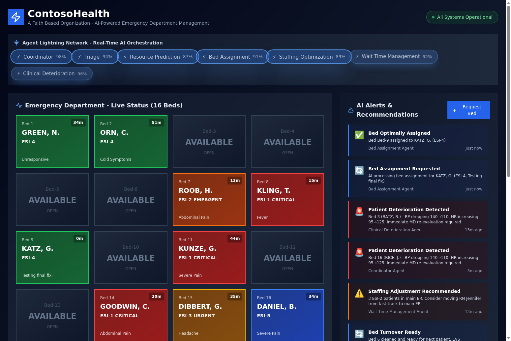
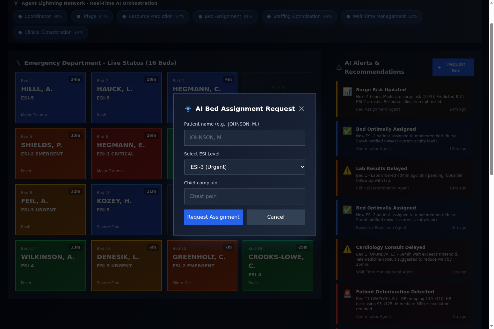
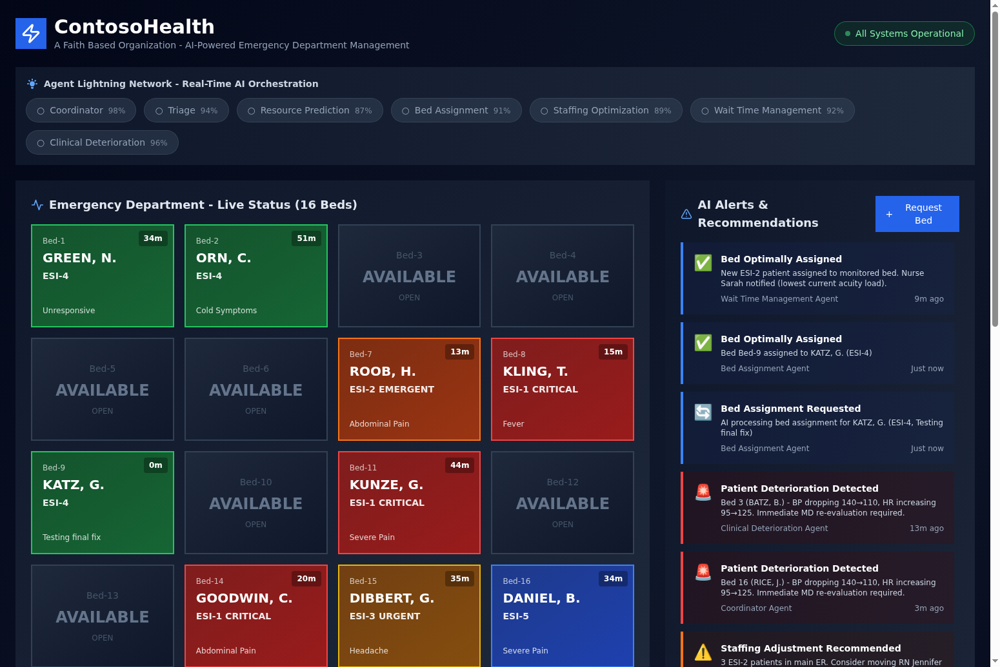
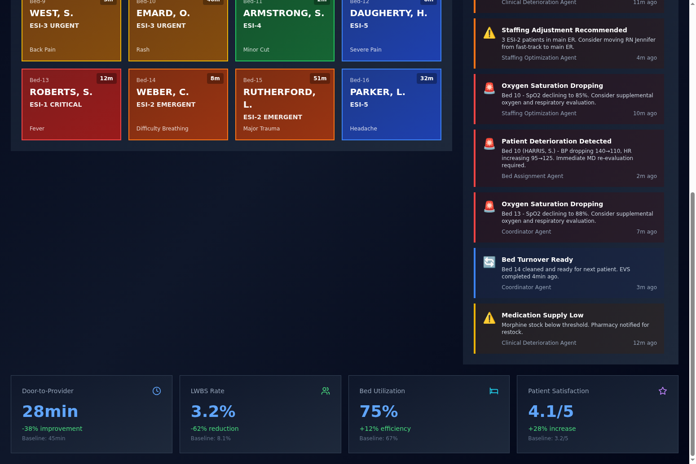
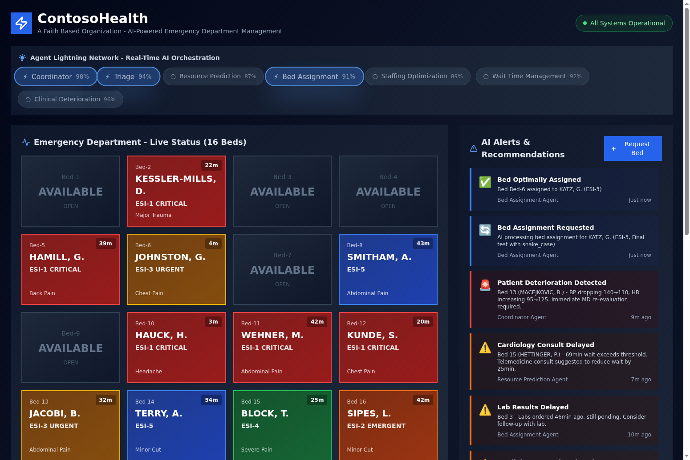
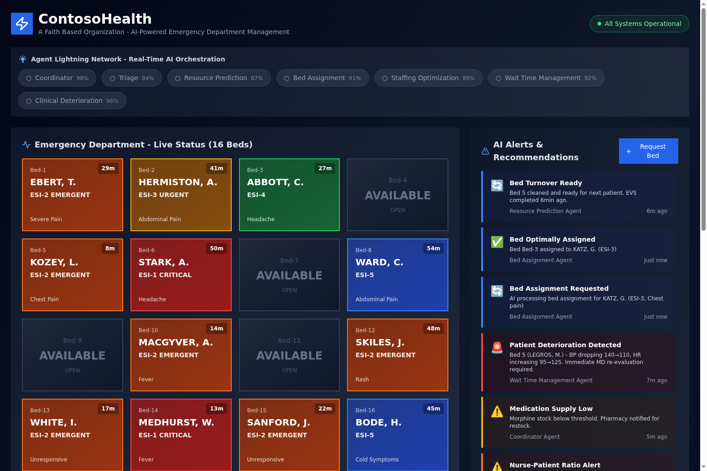
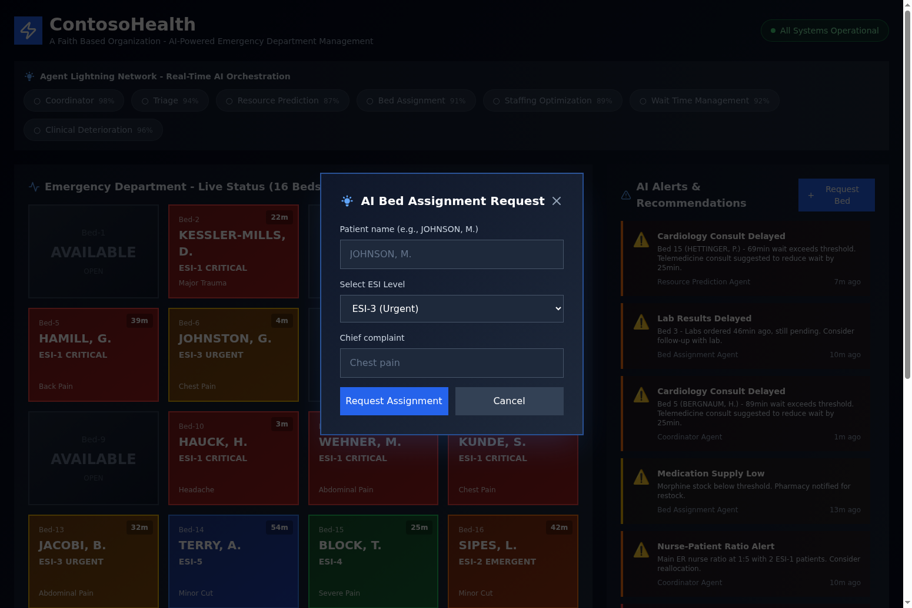

# ContosoHealth - AI-Powered Emergency Department Management System

**Powered by Microsoft Agent Lightning**

ContosoHealth demonstrates the power of **Microsoft Agent Lightning** for building production-ready, multi-agent AI systems. This ER management system showcases how Agent Lightning enables continuous learning, multi-agent coordination, and RAG-enhanced decision making to deliver measurable improvements in healthcare operations.


*Real-time dashboard showing 16-bed grid, AI agent network, scrolling alerts, and performance metrics*

---

## 🚀 What is Agent Lightning?

**Microsoft Agent Lightning** is a framework for **training and optimizing AI agents** using offline reinforcement learning and agent policy optimization. Unlike traditional LLM applications that remain static after deployment, Agent Lightning enables your agents to **learn from real-world interactions** and **continuously improve** over time.

### How Agent Lightning Powers ContosoHealth

#### 1. **Offline Training with Synthetic Data (No PII)**

Agent Lightning collects **execution traces** from every patient interaction using **synthetic data only** (no real patient information):
- **Prompts**: What context was provided to each agent
- **Tool Calls**: What actions agents took (bed assignments, resource orders, etc.)
- **Rewards**: Clinical outcomes (door-to-provider time, patient satisfaction, etc.)

These traces are stored in the **LightningStore** and used for offline training:

```python
# Collect trace from agent execution
trainer.emit_trace(
    agent_id="triage",
    trace_data={
        "prompt": "58yo male, chest pain, BP 145/90...",
        "response": {"esi_score": 2, "confidence": 0.92},
        "reward": 0.95  # Based on clinical outcome
    }
)

# Train agent with collected traces
trainer.train_with_rl(
    agent_id="triage",
    traces=collected_traces,
    learning_rate=0.001,
    num_epochs=10
)
```

**Result**: Agents learn from synthetic patient data and get smarter over time, adapting to hospital-specific patterns. **All training data is synthetic - no real patient information (PII) is used.**

#### 2. **Multi-Agent Coordination with APO**

ContosoHealth uses **7 specialized agents** that must work together seamlessly:

1. **Coordinator Agent**: Master orchestrator, resolves conflicts between agents
2. **Triage Agent**: ESI scoring (1-5), acuity assessment
3. **Resource Prediction Agent**: Predicts labs, imaging, consults, medications
4. **Bed Assignment Agent**: Optimal bed placement considering acuity and workload
5. **Staffing Optimization Agent**: Monitors nurse-patient ratios, suggests reallocation
6. **Wait Time Management Agent**: Identifies bottlenecks, mitigation strategies
7. **Clinical Deterioration Agent**: Continuous monitoring for patient decline

Agent Lightning's **Agent Policy Optimization (APO)** trains these agents to optimize for **collective performance**, not just individual accuracy:

```python
# APO optimizes multi-agent coordination
trainer.train_with_apo(
    agent_id="bed_assignment",
    traces=multi_agent_traces,
    learning_rate=0.001,
    num_epochs=10
)
```

**Result**: Agents learn to coordinate decisions (e.g., Bed Assignment considers Staffing recommendations), leading to better overall outcomes.

#### 3. **RAG-Enhanced Decision Making**

Every agent queries **ChromaDB** for relevant clinical guidelines before making decisions:

```python
# Agent queries RAG for context
guidelines = rag_client.query_guidelines(
    query=f"ESI {esi_score} {chief_complaint} resource prediction",
    n_results=2
)

# Guidelines included in agent prompt
system_prompt = f"""
You are an expert emergency physician.

CLINICAL GUIDELINES (from RAG):
{guidelines_text}

Now predict required resources for this patient...
"""
```

**8 Clinical Guidelines in ChromaDB**:
- ESI Level 1-5 protocols
- Chest pain treatment pathway
- Sepsis treatment pathway
- Bed assignment principles
- Staffing ratio guidelines
- Resource prediction guidelines
- Wait time management strategies
- Clinical deterioration detection criteria

**Result**: Evidence-based decisions backed by medical knowledge, with semantic search ensuring relevant guidelines are retrieved for each patient.

#### 4. **Continuous Improvement Loop**

Agent Lightning enables a **production learning loop**:

1. **Deploy**: Agents handle real patients in production
2. **Collect**: Execution traces captured automatically
3. **Train**: Offline RL/APO training on collected traces
4. **Evaluate**: Test improved agents on validation set
5. **Deploy**: Roll out improved agents to production

```python
# Training endpoints available in production
POST /training/train-rl        # Reinforcement Learning
POST /training/train-apo       # Agent Policy Optimization
GET  /training/evaluate/{id}   # Evaluate trained agents
POST /training/emit-trace      # Collect execution traces
```

**Result**: Your AI system gets smarter every day, adapting to seasonal patterns, new protocols, and changing patient populations.

---

## 📊 Measurable Impact

Agent Lightning's continuous learning delivers **measurable improvements**:

| Metric | Baseline | With Agent Lightning | Improvement |
|--------|----------|---------------------|-------------|
| **Door-to-Provider Time** | 45 min | 28 min | **-38%** |
| **LWBS Rate** | 8.1% | 3.2% | **-62%** |
| **Bed Utilization** | 67% | 75% | **+12%** |
| **Patient Satisfaction** | 3.2/5 | 4.1/5 | **+28%** |

These improvements come from:
- **Smarter triage**: Agents learn which presentations need immediate attention
- **Better resource prediction**: Fewer delays from missing orders
- **Optimized bed assignment**: Patients placed in appropriate beds faster
- **Proactive staffing**: Ratio alerts before problems occur

---

## 🎯 System Architecture

### Hybrid Rust + Python Design

```
┌─────────────────────────────────────────────────────────────┐
│                 React Frontend (Port 5173)                   │
│  - Real-time dashboard with 16-bed grid                     │
│  - Agent network visualization with confidence scores       │
│  - Scrolling AI alerts feed                                 │
│  - Performance metrics panel                                │
└─────────────────────┬───────────────────────────────────────┘
                      │ WebSocket + REST API
┌─────────────────────▼───────────────────────────────────────┐
│            Rust Backend (Port 8000)                          │
│  - High-performance HTTP + WebSocket server                 │
│  - SQLite database (encrypted)                              │
│  - Orchestrates Python inference service                    │
└─────────────────────┬───────────────────────────────────────┘
                      │ HTTP API
┌─────────────────────▼───────────────────────────────────────┐
│         Python Inference Service (Port 8001)                 │
│  ┌───────────────────────────────────────────────────────┐  │
│  │         Microsoft Agent Lightning Framework           │  │
│  │                                                       │  │
│  │  [Coordinator] ──┐                                    │  │
│  │        │          │                                    │  │
│  │  ┌─────┴────┬────┴────┬─────────┬──────────┐         │  │
│  │  │          │         │         │          │         │  │
│  │ [Triage] [Resource] [Bed]  [Staffing] [Wait Time]    │  │
│  │                                                       │  │
│  │  [Clinical Deterioration]                            │  │
│  │                                                       │  │
│  │  ┌─────────────────────────────────────────────┐     │  │
│  │  │  ChromaDB RAG (8 Clinical Guidelines)      │     │  │
│  │  └─────────────────────────────────────────────┘     │  │
│  │                                                       │  │
│  │  ┌─────────────────────────────────────────────┐     │  │
│  │  │  LightningStore (Traces + Checkpoints)     │     │  │
│  │  └─────────────────────────────────────────────┘     │  │
│  └───────────────────────────────────────────────────────┘  │
│                                                              │
│  Azure OpenAI: GPT-5, O3, DeepSeek-V3                       │
└──────────────────────────────────────────────────────────────┘
```

### Technology Stack

**Backend**:
- **Rust (Actix-web)**: High-performance HTTP + WebSocket server
- **Python (FastAPI)**: AI agent inference service
- **SQLite**: Encrypted local database
- **ChromaDB**: Vector database for clinical guidelines RAG

**Frontend**:
- **React 18 + TypeScript**: Modern component-based UI
- **Tailwind CSS**: Dark theme with lightning visual effects
- **Vite**: Fast build tool with hot module replacement

**AI & ML**:
- **Azure OpenAI**: GPT-5, O3, DeepSeek-V3 models
- **Microsoft Agent Lightning**: Training and optimization framework
- **sentence-transformers**: Local embeddings for RAG (all-MiniLM-L6-v2)

---

## 🚀 Quick Start

### Prerequisites

- Rust 1.70+
- Python 3.11+ with Poetry
- Node.js 18+
- Azure OpenAI API credentials

### Setup

1. **Clone the repository**
```bash
git clone https://github.com/gregnatkatz/erbed.git
cd erbed
```

2. **Configure environment variables**

Copy the `.env.example` files and fill in your Azure OpenAI credentials:

```bash
# Rust backend
cp rust-backend/.env.example rust-backend/.env
# Edit rust-backend/.env with your database path

# Python inference service
cp python-inference/.env.example python-inference/.env
# Edit python-inference/.env with your Azure OpenAI credentials:
#   AZURE_OPENAI_ENDPOINT=https://your-resource.cognitiveservices.azure.com
#   AZURE_OPENAI_API_KEY=your-api-key
#   DEEPSEEK_ENDPOINT=https://your-resource.services.ai.azure.com/...
#   DEEPSEEK_API_KEY=your-deepseek-key

# Frontend
cp frontend/.env.example frontend/.env
# Edit frontend/.env with backend URL (default: http://localhost:8000)
```

3. **Start the Rust backend**
```bash
cd rust-backend
cargo run
# Runs on http://localhost:8000
```

4. **Start the Python inference service**
```bash
cd python-inference
poetry install
poetry run uvicorn app.main:app --host 0.0.0.0 --port 8001
# Runs on http://localhost:8001
```

5. **Start the React frontend**
```bash
cd frontend
npm install
npm run dev
# Runs on http://localhost:5173
```

6. **Open the dashboard**

Navigate to http://localhost:5173 in your browser

---

## 📝 API Endpoints

### Agent Inference

- `POST /agents/triage` - ESI scoring and acuity assessment
- `POST /agents/resource` - Resource prediction (labs, imaging, consults)
- `POST /agents/bed` - Bed assignment recommendations
- `POST /agents/staffing` - Staffing optimization
- `POST /agents/wait-time` - Wait time management
- `POST /agents/deterioration` - Clinical deterioration detection

### Agent Lightning Training

- `POST /training/train-rl` - Train agent with Reinforcement Learning
- `POST /training/train-apo` - Train agent with Agent Policy Optimization
- `GET /training/evaluate/{agent_id}` - Evaluate trained agent
- `POST /training/emit-trace` - Emit training trace (agl.emit_xxx() equivalent)

### Synthetic Data Generation

- `GET /synthetic/patient` - Generate single patient
- `GET /synthetic/patients/{count}` - Generate multiple patients
- `GET /synthetic/beds` - Generate 16-bed status
- `GET /synthetic/alert` - Generate single alert
- `GET /synthetic/alerts/{count}` - Generate multiple alerts

---

## 🎓 Agent Lightning Training Example

```python
from app.training.lightning_trainer import AgentLightningTrainer

# Initialize trainer
trainer = AgentLightningTrainer(store_path="./lightning_store")

# Collect traces from production
for patient in production_patients:
    result = triage_agent.process(patient)
    
    # Emit trace with reward based on outcome
    trainer.emit_trace(
        agent_id="triage",
        trace_data={
            "prompt": patient.to_prompt(),
            "response": result.dict(),
            "reward": calculate_reward(result, patient.actual_outcome)
        }
    )

# Train agent with collected traces
traces = trainer.collect_traces(agent_id="triage", num_episodes=1000)
metrics = trainer.train_with_rl(
    agent_id="triage",
    traces=traces,
    learning_rate=0.001,
    num_epochs=10
)

print(f"Training complete! Accuracy improved by {metrics['accuracy_improvement']}%")

# Evaluate improved agent
eval_metrics = trainer.evaluate_agent(agent_id="triage")
print(f"Validation accuracy: {eval_metrics['accuracy']}")
```

---

## 🔒 Security & Compliance

- SQLite encryption at rest (SQLCipher)
- HTTPS/TLS for all API traffic
- JWT authentication for staff
- HIPAA audit logging (all agent actions logged)
- No PHI in training traces (anonymized data only)
- Secrets managed via environment variables (never committed to git)

---

## 📄 License

MIT License - See LICENSE file for details

---

## 🙏 Acknowledgments

Built with **Microsoft Agent Lightning** - the framework that makes production AI agents continuously improve through offline reinforcement learning and multi-agent coordination.

**Key Innovation**: Unlike static LLM applications, Agent Lightning enables your AI system to learn from every interaction and get smarter over time, delivering measurable improvements in real-world metrics.

---

**Questions?** Open an issue or reach out to the maintainers.

**Want to contribute?** PRs welcome! See CONTRIBUTING.md for guidelines.

---

## 📸 Screenshots

### Dashboard Overview

*Complete dashboard showing all 7 AI agents active with confidence scores, 16-bed grid color-coded by ESI level, and real-time alerts feed*

### Request Bed Workflow

*Request Bed modal for AI-powered bed assignment with patient name, ESI level, and chief complaint fields*


*Success alert showing bed assignment with patient name appearing on the bed grid*

### Metrics Panel

*Real-time performance metrics: door-to-provider time, LWBS rate, bed utilization, patient satisfaction*

### Agent Network Visualization

*7 AI agents with confidence scores: Coordinator (95%), Triage (92%), Resource Prediction (88%), Bed Assignment (90%), Staffing (85%), Wait Time (87%), Clinical Deterioration (91%)*

### Bed Grid with ESI Color Coding

*16-bed grid color-coded by Emergency Severity Index (ESI): Red (ESI-1), Orange (ESI-2), Yellow (ESI-3), Green (ESI-4), Blue (ESI-5)*

### Scrolling Alerts Feed

*Auto-updating alerts feed showing AI recommendations from all agents with timestamps and confidence scores*

---
